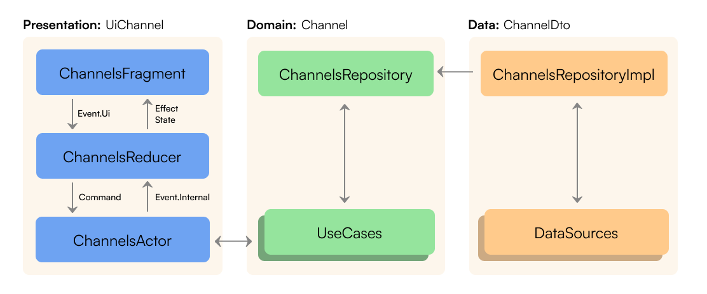

# TFS Android 2023

## Архитектура

Архитектура приложения представлена ниже на примере модуля `feature:channels`. Остальные
feature-модули сделаны аналогично.


## Модуляризация

| Модуль             | Тип модуля          | Описание                                                                                                                                                        |
|--------------------|---------------------|-----------------------------------------------------------------------------------------------------------------------------------------------------------------|
| `:app`             | Android Application | Объединяет все необходимое для корректной работы приложения.                                                                                                    |
| `core:common`      | Java/Kotlin Library | Общие классы, совместно используемые модулями.                                                                                                                  |
| `core:components`  | Android Library     | Компоненты пользовательского интерфейса, расширения, базовые классы.                                                                                            |
| `core:network`     | Android Library     | API для обработки сетевых запросов и ответов от удаленного источника данных.                                                                                    |
| `core:database`    | Android Library     | Реализация локальной базы данных с помозью библиотеки `Room`.                                                                                                   |
| `core:auth`        | Android Library     | Классы, отвечающие за логику авторизации.                                                                                                                       |
| `core:ui`          | Android Library     | Ресурсы, используемые различными функциями.                                                                                                                     |
| `feature:channels` | Android Library     | Отображает все каналы и подписанные на них с помощью `ChannelFragment` и `HolderChannelFragment`.                                                               |
| `feature:chat`     | Android Library     | Отображает сообщения выбранной темы канала, предоставляет возможность добавить или удалить реакцию на сообщение с помощью `ChatFragment` и `EmojiListFragment`. |
| `feature:profile`  | Android Library     | Отображает профиль пользователя с помощью `ProfileFragment`.                                                                                                    |
| `feature:users`    | Android Library     | Отображает сведения обо всех пользователях в организации с помощью `UsersFragment`.                                                                             |

## Технологии

- **Coroutines**, Flow - Асинхронная работа и т.д.
- **Retrofit2** - Запросы в сеть.
- **Kotlinx Serialization** - Сериализация данных.
- **Coil** - Загрузка изображений по сети, кэширование загруженного.
- **Jetpack Paging 3** - Загрузка и отображение небольших фрагментов данных.
- **Android Navigation Component** - Навигация по приложению.
- **ViewBinding** - Улучшение и оптимизация кода, связанного со слоем представления.
- **Shimmer** (Facebook library) - Отображение зарузки данных.
- **Dagger2** - Внедрение зависимостей.
- **Elmslie** - Для упрощения реализации ELM-архитектуры.
- **Room** - Уровень абстракции поверх SQLite, позволяющий осуществлять свободный доступ к базе
  данных.
- **DataStore** - Хранение данных в виде пар ключ-значение с использованием `coroutines` и `Flow`
  для асинхронных операций.
- **Timber** - `Logger` с небольшим, расширяемым API, который предоставляет утилиту поверх обычного
  класса `Log`.
- **Leak Canary** - Для обнаружения утечек памяти для Android.

## Требования

Для полноценной работы с Zulip API, использующемся в приложении, необходим API-ключ.
[Как получить API-ключ](https://zulip.com/api/api-keys)
После получения ключа допишите следующие строки в файл `local.properties`:

```
username=<логин>
password=<API-ключ>
```

