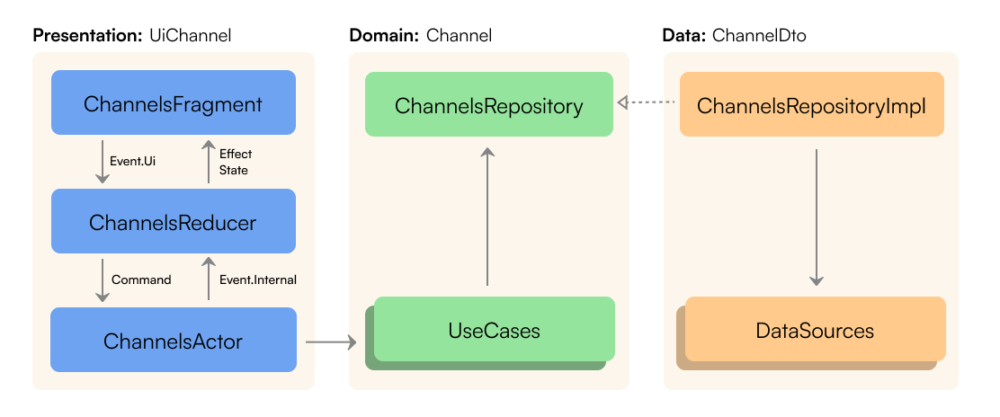

# ChatApp

## Description

A mobile client for the Zulip API.

## Features

- [X] Create your own channel ("+" button on the screen with
  channels `Channels Fragment`)
- [X] Open messages for both the channel (**long tap** on the channel
  in `Channels Fragment`) and the topic (click on the topic in `Channels Fragment`)
- [X] Write to different topics with topics suggestions (possible only from the **chat channel** in `ChatFragment`)
- [X] Open channel topic from **channel chat** to `ChatFragment` (click on the topic)
- [X] Add and remove reaction to message
- [X] Delete, edit and copy a message (long tap on message in `Chat Fragment`)
- [X] Send message or upload a file (button in `Chat Fragment`)
- [X] Search messages, users and channels (channels search temporarily is not working)
- [X] Light and Dark theme

## To start

To fully work with the Zulip API used in the application, an account and organization are required.
1. [Create account and organization](https://zulip.com/new/)
2. Add the following line to the `local.properties` file, `base_url` is the URL of the organization that was used when creating the organization
4. Start an app, log in using your email address and password

```
base_url=<organization URL`>
```

## Arhitecture

The application follows the principles of clean architecture, the presentation layer implements the UDF architectureusing using [Elmslie library](https://github.com/vivid-money/elmslie). **Example** implementation of the `feature:channel` module



## Modules

| Module             | Type       | Description                                                                                                                                                                                       |
|--------------------|---------------------|---------------------------------------------------------------------------------------------------------------------------------------------------------------------------------------------------|                                                       
| `:core:common`     | Java/Kotlin Library | Common Kotlin classes                                                                                                                 |
| `:core:components` | Android Library     | UI components, extension functions, base Andorid classes                                                                              |
| `:core:network`    | Android Library     | Network work                                                                                                                          |
| `:core:auth`       | Android Library     | Common authorization logic                                                                                                            |
| `:core:ui`         | Android Library     | Themes, styles, shapes and other resources used by modules.                                                                           |
| `:core:ui-compose` | Android Library     | Themes and base composables                                                                                                           |
| `:feature:channels`| Android Library     | Channels and topics                                                                                                                   |
| `:feature:chat`    | Android Library     | Channel or topic messages, message mofifications (editing, deleting, adding or removing reactions etc)                                |
| `:feature:profile` | Android Library     | User profile                                                                                                                          |
| `:feature:users`   | Android Library     | Information about all users in the organization                                                                                       |
| `:feature:auth`    | Android Library     | Login and signup                                                                                                                      |

## Tech stack

- **Coroutines, Flow** 
- **Retrofit 2** 
- **OkHttp**
- **Kotlin Serialization** 
- **Coil**
- **Jetpack Paging 3** 
- **Android Navigation Component**
- **ViewBinding**
- **Compose**
- **Facebook Shimmer**
- **Dagger2**
- **Elmslie**
- **Room**
- **DataStore**
- **Timber**
- **Leak Canary**
